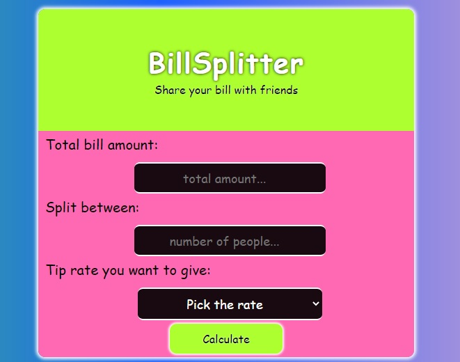

# BillSplitterApp

## Demo

[**click live demo of the project**](https://dominiksiejka.github.io/BillSplitterApp)



## Table of Contents

- [About the Project](#description)
- [How to use](#how-to-use)
- [Technologies used](#built-with)
- [Setup steps](#setup)
- [Sources](#sources)
- [License](#license)

## Description

BillSplitterApp makes life easier, when you go out and meet with friends for something to eat. It enables you to calculate the amount of money that each of you should pay, so it spreads the total amount of the bill including a tip for the waiter of waitress.

## How to use

You need to fill in every single input available in the project in order to calculate the proper value. Then press the button at the bottom to submit all informations and calculate the right amount. Then the right amout will appear on the screen.

## Built with

- HTML5
- CSS/SASS
- Vanilla JavaScript

## Setup

```
with BASH

# clone the remote repo to your local one
$ git clone https://github.com/dominiksiejka/BillSplitterApp.git

# open the index.html file or use your code editor to open it with live server

```

## Sources

- Icons from [Font Awesome ](https://fontawesome.com)
- Font from [Google Fonts ](https://fonts.google.com/)

## License

- MIT © [Dominik Siejka ](https://github.com/dominiksiejka/BillSplitterApp)
